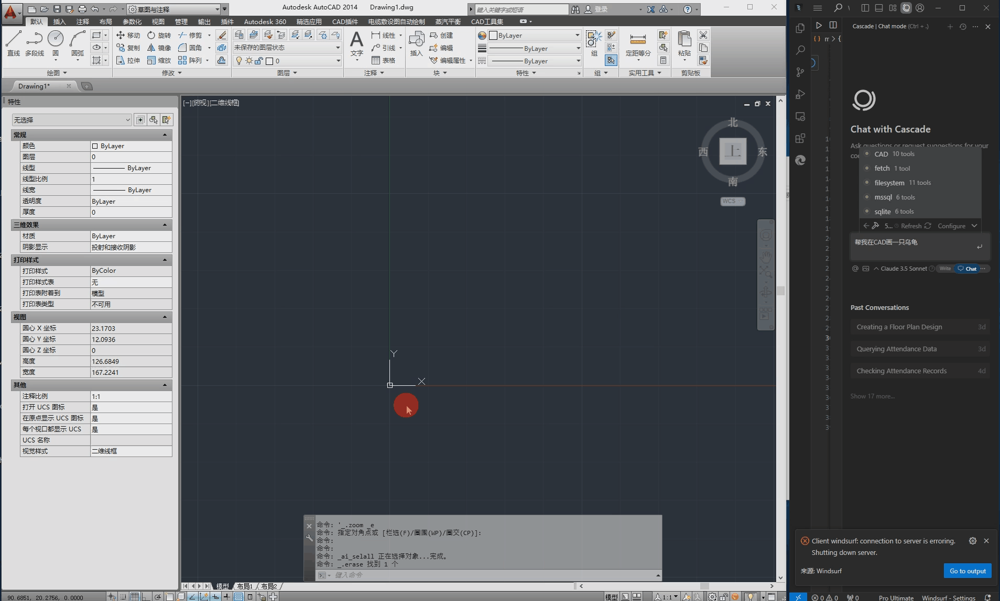
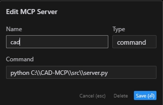

# CAD-MCP Server (CAD Model Context Protocol Server)

仓库首页见上级目录 [`README.md`](../README.md)。本文只说明 `CAD-MCP/` 子项目。

## 项目介绍

CAD-MCP 是一个基于 **MCP（Model Context Protocol）** 的 CAD 控制服务，允许通过 AI 助手（如 Cursor、Claude Desktop）或自然语言指令控制 CAD 软件进行绘图与 3D 配管建模。项目结合自然语言处理、CAD 自动化与参数化脚本，使用户无需手工操作 CAD 界面即可创建和修改图纸。

## 功能特点

### CAD 软件支持

- 支持 AutoCAD
- 支持浩辰 CAD（GCAD / GstarCAD）
- 支持中望 CAD（ZWCAD）

### 2D 基础绘图

- 直线绘制（`draw_line`）
- 圆形绘制（`draw_circle`）
- 圆弧绘制（`draw_arc`）
- 椭圆绘制（`draw_ellipse`）
- 矩形绘制（`draw_rectangle`）
- 多段线绘制（`draw_polyline`）
- 样条曲线绘制（`draw_spline`）
- 单行文本添加（`draw_text`）
- 多行文本添加（`draw_mtext`）
- 图案填充（`draw_hatch`）
- 尺寸标注（`add_dimension`）：对齐、水平、垂直、直径、半径
- 批量尺寸标注（`apply_dimensions`）

### 3D 实体绘制

- 球体（`draw_sphere`）
- 长方体 / 正方体（`draw_box`）
- 圆柱体（沿 Z 轴，`draw_cylinder`）
- 沿 Y 轴圆柱体（`draw_cylinder_along_y`）
- 圆锥体（`draw_cone`）
- 圆环体（`draw_torus`）
- 楔体（`draw_wedge`）
- 半球（`draw_hemisphere`）
- 半球并沿 Y 轴拉伸（`draw_hemisphere_extruded_y`）

### 3D 实体编辑

- 布尔并集（`boolean_union`）
- 布尔交集（`boolean_intersect`）
- 布尔差集（`boolean_subtract`）
- 实体旋转（`rotate_entity`）
- 拉伸（`extrude_entity`，沿高度或沿路径）
- 旋转成型（`revolve_entity`）

### 视图与图纸管理

- 缩放到全部对象（`zoom_extents`）
- 切换命名视图（`set_named_view`）：主视图 / 俯视图 / 左视图 / 右视图 / 后视图 / 仰视图，以及西南 / 东南 / 东北 / 西北等轴测等
- 图层、颜色、线宽参数（各绘制工具可选）
- 自然语言创建 / 切换图层（经 `process_command`）
- 保存图纸为 DWG（`save_drawing`）

### 国标管件与配管零件

- 管道弯头（`draw_pipe_elbow`）：GB/T 12459；支持 45° / 90° / 180°；LR / SR / 3D；可按 DN 联动壁厚画空心弯头
- 异径管（`draw_reducer`）：同心 / 偏心；GB/T 12459
- 三通（`draw_tee`）：等径 / 异径；GB/T 12459；默认空心流道
- 法兰盘（`draw_flange`）：GB/T 9124.1 PN 系列 / GB/T 9124.2 Class 系列；按 DN / PN 查表或自定义尺寸
- 盲板 / 法兰盖（`draw_blind_flange`）：GB/T 9124.1 / GB/T 9124.2 等
- 人孔（`draw_manhole`）：带颈、法兰、盖板、提手 / 吊耳等参数化表达

### 紧固件

- 六角头螺栓（`draw_bolt`）：GB/T 5782、GB/T 5783；亦支持自定义尺寸
- 六角螺母（`draw_hex_nut`）：GB/T 6170 / GB/T 6170.1
- 平垫圈（`draw_washer`）：GB/T 97.1

### 阀门

- 球阀（`draw_ball_valve`）：GB/T 12237、GB/T 12221；法兰 / 螺纹 / 承插焊 / 对焊等连接型式
- 蝶阀（`draw_butterfly_valve`）：GB/T 12238、GB/T 12221
- 截止阀（`draw_globe_valve`）：GB/T 12235、GB/T 12221
- 止回阀（`draw_check_valve`）：GB/T 12236、GB/T 12221；优先旋启式

### 仪表、封头与工程附件

- 一般压力表（`draw_pressure_gauge`）：GB/T 1226；Y-60 / Y-100 / Y-150；径向 / 轴向；直装 / 盘装
- 椭圆封头（`draw_elliptical_head`）：GB/T 25198；2:1 椭圆；可选直边
- 刚性防水套管（`draw_rigid_waterproof_sleeve`）：02S404 A 型等
- 钢制喇叭口（`draw_steel_bellmouth`）：02S403 吸水喇叭口系列
- 双法兰限位伸缩接头（`draw_double_flange_limit_expansion_joint`）：GB/T 12465；JSSJA-2 / VSSJA-2(B2F) 等
- 吸水喇叭管支架（`draw_suction_bellmouth_support`）：02S403 ZA/ZB/ZC/ZD 系列（如 ZB3）

### 识图、配管语义与 JSON 出图

- 识别 PDF / 图片图纸并输出结构化配管语义模型（`parse_drawing_document`）
- 将 PDF / 图片渲染为高清图后做视觉分析（`analyze_document_visual`）
- 对语义模型应用人工确认结果（`apply_pipeline_review`）
- 将已确认语义模型转为 3D 配管绘制（`draw_pipeline_from_json`）

### 视觉闭环（可选，默认关闭）

- 获取最近一次视觉反馈（`get_latest_vision_feedback`）
- 主动分析当前 CAD 视图（`analyze_current_view`）
- 启用 / 停用视觉轮询回路（`set_vision_loop_enabled`）
- MCP 资源：`drawing://current`、最新视觉反馈、视觉任务 `vision://jobs/<job_id>`
- 配置见 `src/config.json` 的 `vision` 段；API 密钥通过环境变量（如 `OPENROUTER_API_KEY`）注入，不写入仓库

### 自然语言处理

- 自然语言命令处理（`process_command`）
- 命令解析为 CAD 操作参数
- 颜色识别并应用到绘图对象
- 形状关键词映射
- 动作关键词映射（含保存、视图、图层等）

### 提示词（MCP Prompt）

- `cad-assistant`：通过自然语言控制 CAD 的助手提示模板

### 配管连接与参数化支撑库（源码模块）

- `pipeline_connection_helper.py`：弯头等正交连接的端口、切点、旋转与断管连接骨架
- `pipeline_models.py`：配管数据模型
- `pipeline_builder.py`：配管构建逻辑
- `drawing_parser.py`：图纸文档解析
- `global_drawing_experience.py`：跨任务绘图经验库
- `drawing_validation/`：出图校验上下文、规则与报告
- `screen_capture.py` / `vision_loop.py` / `vision_provider.py`：截图与视觉回路
- `archive_output_versions.py`：本地 `output/` 版本目录整理工具
- `cad_controller.py`：CAD COM 控制器与国标件实现核心

### 参数化案例与校验脚本（`src/parametric_models/`）

- `basic_solids_one_dwg_demo`：基础 3D 实体合图演示
- `boolean_spheres_demo`：布尔运算球体演示
- `standard_parts_grid_demo`：标准件网格演示
- `three_valves_one_dwg_demo`：三阀合图演示
- `dn250_elbow_demo`：DN250 弯头演示
- `dn250_elbow_angle_suite`：DN250 弯头角度套件
- `dn250_standard_elbow_suite`：DN250 标准弯头套件
- `dn250_tee_break_demo`：DN250 三通断管演示
- `ee_left_elbow_helper_probe`：弯头 helper 探针脚本
- `globe_valve_view_validation`：截止阀视图校验
- `butterfly_valve_left_view_validation`：蝶阀左视图校验
- `manhole_standard_validation`：人孔标准校验
- `compressed_air_tank_parametric`：压缩空气储罐参数化
- `compressed_air_tank_parametric_from_scratch`：压缩空气储罐从零参数化
- `raw_water_tank_parametric`：原水箱参数化
- `cycle_water_equipment_from_json`：循环水设备 JSON 出图
- `cycle_water_pipeline_from_json`：循环水管道 JSON 出图
- `cycle_water_section_route_validation`：循环水剖面路由校验
- `cycle_water_dd_rebuilt`：D-D 剖面重建
- `dd_section_from_scratch`：D-D 剖面从零绘制
- `cycle_water_ff_hh_local_rebuilt`：F-F / H-H 局部重建
- `cycle_water_aa_right_validation`：A-A 右侧校验
- `cycle_water_aa_p0204_validation`：A-A / P0204 校验
- `cycle_water_pump_complete_local`：循环水泵局部完整绘制
- `cycle_water_y0202_tank_ii_validation`：Y0202 水箱 II 校验

### 可选旁路：LangChain 内存迭代代码生成（不影响主链路）

识图 / 写 JSON / 绘图 / 检查 / 重绘仍只走 Cursor + MCP + `src/`。  
旁路试点用内存链保存推理历史与中间结果，做上下文感知的迭代代码草稿生成：

```text
python -m pip install -r requirements-langchain-optional.txt
python -m experimental.langchain_pilot
```

详见 `experimental/langchain_pilot/README.md`。

## Demo



## 安装要求

### 依赖项

```text
pywin32>=228         # Windows COM 接口支持
mcp>=0.1.0           # Model Context Protocol 库
pydantic>=2.0.0      # 数据验证
typing>=3.7.4.3      # 类型注解支持
PyMuPDF>=1.24.0      # PDF 识图
Pillow>=10.0.0       # 图像处理 / 截图相关
```

可选 LangChain 旁路依赖见 `requirements-langchain-optional.txt`。

### 系统要求

- Windows 操作系统
- 已安装的 CAD 软件（AutoCAD、浩辰 CAD 或中望 CAD）
- Python 3.x

建议在本目录（`CAD-MCP/`）中安装：

```text
python -m venv venv
venv\Scripts\activate
pip install -r requirements.txt
```

## 配置说明

配置文件位于 `src/config.json`，包含以下主要设置：

```json
{
    "server": {
        "name": "CAD MCP 服务器",
        "version": "1.0.0"
    },
    "cad": {
        "type": "AUTOCAD",
        "startup_wait_time": 20,
        "command_delay": 0.5,
        "boolean_union": 0,
        "boolean_intersection": 1,
        "boolean_subtraction": 2
    },
    "output": {
        "directory": "./output",
        "default_filename": "cad_drawing.dwg"
    },
    "vision": {
        "enabled": false,
        "provider": "openrouter",
        "model": "openai/gpt-5.4",
        "api_key_env": "OPENROUTER_API_KEY",
        "base_url": "https://openrouter.ai/api/v1/chat/completions",
        "app_name": "CAD-MCP",
        "site_url": "https://cursor.local",
        "poll_interval_ms": 2000,
        "diff_threshold": 0.0,
        "timeout_sec": 60,
        "capture_output_dir": "./output/vision_captures"
    }
}
```

- **server**：服务器名称和版本信息
- **cad**：
  - `type`：CAD 软件类型（AUTOCAD、GCAD、GstarCAD 或 ZWCAD）
  - `startup_wait_time`：CAD 启动等待时间（秒）
  - `command_delay`：命令执行延迟（秒）
  - `boolean_*`：布尔运算类型码
- **output**：输出目录与默认文件名
- **vision**：视觉回路配置（默认关闭；密钥走环境变量，勿写入仓库）

## 使用方法

### 启动服务

```text
python src/server.py
```

### Claude Desktop、Windsurf

```json
{
    "mcpServers": {
        "CAD": {
            "command": "python",
            "args": [
                "C:\\path\\to\\CAD-MCP\\src\\server.py"
            ]
        }
    }
}
```

### Cursor

按图配置 Cursor MCP（请改成你的本机路径）：



说明：新版 Cursor 也改为 JSON 配置，参见上一节。

### MCP Inspector

```text
npx -y @modelcontextprotocol/inspector python C:\\path\\to\\CAD-MCP\\src\\server.py
```

### 服务 API（MCP Tools，完整列表）

#### 2D 绘图

- `draw_line`：绘制直线
- `draw_circle`：绘制圆
- `draw_arc`：绘制弧
- `draw_ellipse`：绘制椭圆
- `draw_polyline`：绘制多段线
- `draw_rectangle`：绘制矩形
- `draw_spline`：绘制样条曲线
- `draw_text`：添加单行文本
- `draw_mtext`：添加多行文本
- `draw_hatch`：绘制填充
- `add_dimension`：添加尺寸标注
- `apply_dimensions`：批量添加尺寸标注

#### 3D 实体与编辑

- `draw_sphere`：绘制球体
- `draw_box`：绘制长方体 / 正方体
- `draw_cylinder`：绘制圆柱体（沿 Z）
- `draw_cylinder_along_y`：绘制沿 Y 轴圆柱体
- `draw_cone`：绘制圆锥体
- `draw_torus`：绘制圆环体
- `draw_wedge`：绘制楔体
- `draw_hemisphere`：绘制半球
- `draw_hemisphere_extruded_y`：半球并沿 Y 拉伸
- `boolean_union`：布尔并集
- `boolean_intersect`：布尔交集
- `boolean_subtract`：布尔差集
- `rotate_entity`：旋转实体
- `extrude_entity`：拉伸
- `revolve_entity`：旋转成型

#### 管件、紧固件、阀门与附件

- `draw_pipe_elbow`：管道弯头
- `draw_reducer`：异径管
- `draw_tee`：三通
- `draw_flange`：法兰
- `draw_blind_flange`：盲板
- `draw_manhole`：人孔
- `draw_bolt`：螺栓
- `draw_hex_nut`：六角螺母
- `draw_washer`：平垫圈
- `draw_ball_valve`：球阀
- `draw_butterfly_valve`：蝶阀
- `draw_globe_valve`：截止阀
- `draw_check_valve`：止回阀
- `draw_pressure_gauge`：压力表
- `draw_elliptical_head`：椭圆封头
- `draw_rigid_waterproof_sleeve`：刚性防水套管
- `draw_steel_bellmouth`：钢制喇叭口
- `draw_double_flange_limit_expansion_joint`：双法兰限位伸缩接头
- `draw_suction_bellmouth_support`：吸水喇叭管支架

#### 识图、配管、视觉与通用

- `parse_drawing_document`：识别图纸文档
- `analyze_document_visual`：文档视觉分析
- `apply_pipeline_review`：应用配管人工复核
- `draw_pipeline_from_json`：由 JSON 语义模型绘制管道
- `get_latest_vision_feedback`：获取最新视觉反馈
- `analyze_current_view`：分析当前视图
- `set_vision_loop_enabled`：开关视觉轮询
- `process_command`：处理自然语言命令
- `save_drawing`：保存图纸
- `zoom_extents`：缩放到全部
- `set_named_view`：切换命名视图

## 项目结构

```text
CAD-MCP/
├── imgs/                              # 图像和演示资源
│   ├── demo.gif
│   └── cursor_config.png
├── experimental/                      # 可选旁路（LangChain pilot）
│   └── langchain_pilot/
├── requirements.txt                   # 主服务依赖
├── requirements-langchain-optional.txt
├── README_zh.md                       # CAD-MCP 中文说明
├── README_en.md                       # CAD-MCP 英文说明
├── output/                            # 绘制结果：shared/ 与配管图，按版本归档
└── src/                               # 源代码
    ├── __init__.py
    ├── server.py                      # MCP 服务入口与工具注册
    ├── cad_controller.py              # CAD 控制器与国标件实现
    ├── config.json                    # 配置文件
    ├── nlp_processor.py               # 自然语言处理器
    ├── drawing_parser.py              # 图纸文档解析
    ├── pipeline_builder.py            # 将配管语义模型转换为 CAD 绘制调用
    ├── pipeline_connection_helper.py  # 管件端口、切点、断管和弯头连接辅助
    ├── pipeline_models.py             # 配管语义模型、BOM、尺寸台账等数据结构
    ├── global_drawing_experience.py   # 跨任务绘图经验库
    ├── screen_capture.py              # CAD 视图截图与预览输出
    ├── vision_loop.py                 # 当前 CAD 视图视觉轮询与分析回路
    ├── vision_provider.py             # 视觉模型 Provider 调用封装
    ├── archive_output_versions.py     # 本地 output 版本目录归档整理工具
    ├── drawing_validation/            # 出图校验
    └── parametric_models/             # 参数化案例与校验脚本
```

`output/` 用于存放绘制文件（`shared/` 与配管图），按版本归档。本地 `venv/`、日志、缓存默认不纳入版本库。

## 许可证

非商业学术使用许可。允许学术、教学、研究和个人非商业用途；商业使用需要另行取得书面许可。详见上级目录 `LICENSE`。
